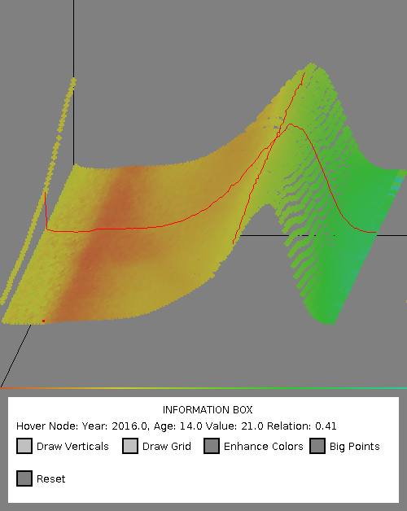

# InfoVisProject
InvoVIs Project for 4D Data Visulization

## Description:

This is a visulization program for 4 dimentional data, with the use of a 3D coordinate system and a color component, realized in Java/JFrame.
The examined data is the [USA Mortality Rate](https://usa.mortality.org/national.php?national=USA) of Women and Men from 0-110 years, of the past 56 years.

### diagram 
X-axis: year
y-axis: age
z-axis: relative mortality
color: relative female/male relation
  (reference colors above info box)

### interactions
- hover mouse over diagram: description of highlighted point
- drag mouse: move coordinate system
- press mouse on highlighted point: highlight X-Y Dimensions
- mouse wheel up and down: enhance or diminish relative z value

- "enhance colors": transfer colors to maximal values
- "big points": increase size of all datapoints
- "reset": reset diagram to start position/values
(only for smaller datasets)
- "draw verticals": draw a vertical line from each point to XY plane
- "draw grid": connect all datapoints with their neighbours resulting in a grid surface
